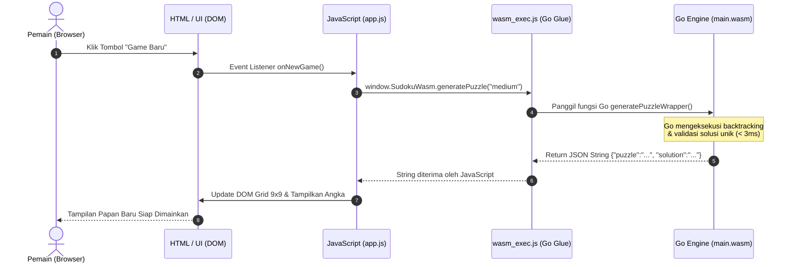

# 🧠 Panduan Lengkap & Penjelasan Cara Kerja WebAssembly (Go-Wasm)

Buku panduan ini ditulis secara khusus untuk menjelaskan **bagaimana WebAssembly (WASM) bekerja**, bagaimana **Go dikompilasi ke Wasm**, dan bagaimana **komunikasi dua arah antara Go dan JavaScript** berlangsung di dalam proyek Sudoku ini.

---

## 📑 DAFTAR ISI
1. [Apa itu WebAssembly & Mengapa Diciptakan?](#1-apa-itu-webassembly--mengapa-diciptakan)
2. [Arsitektur & Alur Kerja WebAssembly di Browser](#2-arsitektur--alur-kerja-webassembly-di-browser)
3. [Bedah Kode: Bagaimana Go Menjadi WebAssembly](#3-bedah-kode-bagaimana-go-menjadi-webassembly)
4. [Peran Krusial `wasm_exec.js` (Jembatan Runtime)](#4-peran-krusial-wasm_execjs-jembatan-runtime)
5. [Komunikasi Dua Arah: Go ↔ JavaScript dengan `syscall/js`](#5-komunikasi-dua-arah-go--javascript-dengan-syscalljs)
6. [Misteri `select {}` (Mengapa Go Runtime Harus Tetap Hidup)](#6-misteri-select--mengapa-go-runtime-harus-tetap-hidup)
7. [Cara Browser Memuat Wasm (`instantiateStreaming`)](#7-cara-browser-memuat-wasm-instantiatestreaming)
8. [Studi Kasus Alur Data: Saat Tombol "Instant Solve" Ditekan](#8-studi-kasus-alur-data-saat-tombol-instant-solve-ditekan)
9. [Masalah MIME Type `application/wasm` & Konfigurasi Vercel](#9-masalah-mime-type-applicationwasm--konfigurasi-vercel)
10. [Rangkuman & Kesimpulan](#10-rangkuman--kesimpulan)

---

## 1. Apa itu WebAssembly & Mengapa Diciptakan?

### 1.1 Keterbatasan Tradisional Browser
Sejak awal era web, browser hanya memahami satu bahasa pemrograman untuk logika dinamis: **JavaScript**.
Meskipun mesin JavaScript modern (seperti V8 di Chrome atau SpiderMonkey di Firefox) sudah sangat cepat berkat teknologi *Just-In-Time (JIT) Compiler*, JavaScript memiliki karakteristik bawaan:
- **Dynamically Typed**: Tipe data variabel bisa berubah-ubah, sehingga compiler harus terus mengecek tipe data saat runtime.
- **Garbage Collection Pauses**: JavaScript mengelola memori secara otomatis yang sewaktu-waktu dapat menyebabkan jeda mikro (*frame drop*).
- **Text-based Parsing**: File `.js` harus diunduh sebagai teks mentah, di-parse menjadi AST (*Abstract Syntax Tree*), lalu dikompilasi.

### 1.2 Masuknya WebAssembly (WASM)
**WebAssembly** adalah standar biner tingkat rendah (*low-level bytecode*) yang dirancang untuk dieksekusi secara aman di dalam browser dengan kecepatan mendekati aplikasi desktop (*near-native speed*).

```
   Bahasa Sumber               Kompilasi                       Target Eksekusi
[ C / C++ / Rust / Go ]  ───►  [ Compiler ]  ───► [ file.wasm ] ───► [ WebAssembly Engine di Browser ]
```

### 1.3 Mengapa Sudoku Menggunakan WebAssembly?
Dalam game Sudoku:
1. **Generator Puzzle Unik**: Menghasilkan puzzle dengan **tepat 1 solusi unik** membutuhkan ratusan iterasi *recursive backtracking* dan pengujian berulang.
2. **Instant Solver**: Mencari solusi dari papan 81 sel dalam hitungan **mikrodetik**.
3. **Zero Backend**: Seluruh komputasi berat ini dijalankan langsung di CPU perangkat pemain tanpa memerlukan server backend API.

---

## 2. Arsitektur & Alur Kerja WebAssembly di Browser

WebAssembly tidak menggantikan JavaScript, melainkan **bekerja berdampingan dengan JavaScript**:



---

## 3. Bedah Kode: Bagaimana Go Menjadi WebAssembly

### 3.1 Perintah Kompilasi
Di komputer kita, compiler Go biasa menghasilkan biner untuk Windows (`.exe`) atau Linux (`ELF`). Untuk menghasilkan WebAssembly, kita mengubah dua variabel lingkungan (*environment variables*):

```bash
# Perintah Kompilasi:
GOOS=js GOARCH=wasm go build -ldflags="-s -w" -o web/main.wasm ./cmd/wasm
```

- **`GOOS=js`**: Memberitahu Go bahwa "Sistem Operasi" target adalah lingkungan JavaScript.
- **`GOARCH=wasm`**: Memberitahu Go bahwa "Arsitektur CPU" target adalah mesin virtual WebAssembly 32-bit.
- **`-ldflags="-s -w"`**: Menghapus informasi debugging (*strip symbol table*) untuk memperkecil ukuran file `.wasm`.

### 3.2 Struktur File Proyek Go
- **`validator.go`**: Memeriksa aturan baris, kolom, dan sub-grid 3x3.
- **`solver.go`**: Algoritma *recursive backtracking* dengan heuristik MRV (*Minimum Remaining Values*).
- **`generator.go`**: Membuat puzzle acak dan menguji keunikan solusi menggunakan `CountSolutions(board, 2) == 1`.
- **`hint.go`**: Menganalisis sel kosong/salah dan memberikan petunjuk logis.
- **`main.go`**: Entry point yang menghubungkan Go ke JavaScript menggunakan paket `syscall/js`.

---

## 4. Peran Krusial `wasm_exec.js` (Jembatan Runtime)

File `.wasm` adalah kode biner murni. Wasm tidak memiliki akses langsung ke layar, DOM, mouse, atau jaringan. Semua interaksi keluar harus melalui JavaScript.

Selain itu, Go memiliki runtime bawaan yang canggih (seperti *Garbage Collector*, *Goroutine Scheduler*, dan alokasi memori). 

**`wasm_exec.js`** adalah file resmi dari tim Go (berada di `$(go env GOROOT)/lib/wasm/wasm_exec.js`) yang menyediakan:
1. **Class `Go` di JavaScript**:
   ```javascript
   const go = new Go();
   ```
2. **`go.importObject`**:
   Objek JavaScript yang berisi fungsi-fungsi sistem tiruan (seperti mencetak teks ke `console.log`, membaca waktu sistem, dan mengelola alokasi memori WebAssembly).
3. **Penerjemah Tipe Data**:
   Menerjemahkan string UTF-8 dan angka antara memori WebAssembly (Linear Memory ArrayBuffer) dan tipe data JavaScript.

---

## 5. Komunikasi Dua Arah: Go ↔ JavaScript dengan `syscall/js`

Paket standar Go `syscall/js` adalah kunci integrasi antara Go dan browser.

### 5.1 Menangkap Objek Global Browser (`window`)
Di dalam `cmd/wasm/main.go`:
```go
import "syscall/js"

func main() {
    // js.Global() merepresentasikan objek 'window' di browser
    jsGlobal := js.Global()
    
    // Membuat objek baru di JS: window.SudokuWasm = {}
    sudokuObj := jsGlobal.Get("Object").New()
    
    // Menempelkan objek ke window
    jsGlobal.Set("SudokuWasm", sudokuObj)
}
```

### 5.2 Mendaftarkan Fungsi Go agar Dapat Dipanggil oleh JavaScript
Setiap fungsi Go yang ingin diekspos ke JavaScript **harus memiliki signature**:
```go
func(this js.Value, args []js.Value) any
```

Contoh pada `solvePuzzleWrapper`:
```go
func solvePuzzleWrapper(this js.Value, args []js.Value) any {
    // 1. Ambil argumen pertama yang dikirim dari JavaScript
    boardStr := args[0].String()

    // 2. Jalankan algoritma Go murni
    board, _ := StringToBoard(boardStr)
    solution, success := Solve(board)

    // 3. Kemas hasil menjadi format JSON
    res := map[string]any{
        "success": success,
        "solution": BoardToString(solution),
    }
    jsonBytes, _ := json.Marshal(res)

    // 4. Return string ke JavaScript
    return string(jsonBytes)
}
```

Lalu kita daftarkan fungsi tersebut menggunakan `js.FuncOf`:
```go
sudokuObj.Set("solvePuzzle", js.FuncOf(solvePuzzleWrapper))
```

### 5.3 Memanggilnya dari JavaScript (`app.js`)
Di JavaScript, fungsi tersebut dapat dipanggil layaknya fungsi JavaScript biasa:
```javascript
// Di file app.js
const boardString = "003020600900305001...";
const responseJson = window.SudokuWasm.solvePuzzle(boardString);

const result = JSON.parse(responseJson);
if (result.success) {
    console.log("Solusi ditemukan:", result.solution);
}
```

---

## 6. Misteri `select {}` (Mengapa Go Runtime Harus Tetap Hidup)

Perhatikan baris terakhir di `cmd/wasm/main.go`:

```go
func main() {
    // Pendaftaran fungsi-fungsi...
    jsGlobal.Set("SudokuWasm", sudokuObj)

    // BLOCKING CHANNEL
    select {}
}
```

### Kenapa harus ada `select {}`?
Dalam program Go biasa di terminal, saat baris terakhir fungsi `main()` selesai, aplikasi akan langsung berhenti (*exit 0*).

Jika fungsi `main()` di WebAssembly selesai, seluruh WebAssembly instance akan di-terminate. Akibatnya, saat user mengklik tombol di browser 5 menit kemudian untuk memanggil `window.SudokuWasm.solvePuzzle()`, browser akan error:
```
Uncaught Error: Go program has already exited
```

Baris `select {}` membuat *main goroutine* menunggu selamanya tanpa memakan CPU (*zero CPU usage*), sehingga runtime Go tetap aktif di memori browser dan siap menerima panggilan fungsi kapan saja.

---

## 7. Cara Browser Memuat Wasm (`instantiateStreaming`)

Di browser modern, cara paling efisien untuk memuat file `.wasm` adalah menggunakan API **`WebAssembly.instantiateStreaming`**.

Lihat implementasi di `web/js/wasm_loader.js`:

```javascript
async function initWasm() {
    // 1. Buat instance Go Runtime glue
    const go = new Go();

    // 2. Download dan kompilasi WebAssembly secara STREAMING
    // (Kompilasi berjalan bersamaan saat file diunduh bit demi bit)
    const wasmModule = await WebAssembly.instantiateStreaming(
        fetch('main.wasm'),
        go.importObject
    );

    // 3. Jalankan instance Go WebAssembly di latar belakang
    go.run(wasmModule.instance);
}
```

Keunggulan `instantiateStreaming`: Browser tidak perlu menunggu seluruh file selesai diunduh baru mengompilasinya. Browser mengompilasi biner WebAssembly bersamaan dengan proses transfer data jaringan.

---

## 8. Studi Kasus Alur Data: Saat Tombol "Instant Solve" Ditekan

Berikut adalah bedah perjalanan data dari klik mouse hingga angka terisi di layar:

```
[1] User mengklik tombol "Instant Solve (WASM)" di UI
      │
      ▼
[2] Event Listener di app.js mengambil status 81 kotak dari array `this.board`
      │ Menghasilkan string 81 karakter, contoh: "530070000600195000..."
      ▼
[3] app.js memanggil: window.SudokuWasm.solvePuzzle(boardStr)
      │
      ▼
[4] wasm_exec.js menyalin string tersebut ke WebAssembly Linear Memory
      │
      ▼
[5] Go Wasm (main.go -> solvePuzzleWrapper) membaca string dari memori
      │ Mengonversinya menjadi matriks [9][9]int
      ▼
[6] Go Solver (solver.go -> Solve) mengeksekusi Recursive Backtracking:
      │ • Menemukan sel kosong dengan kandidat paling sedikit (MRV Heuristic)
      │ • Mencoba angka 1-9 secara rekursif
      │ • Selesai dalam ~450 mikrodetik (0.45 ms)!
      ▼
[7] Go mengemas hasil menjadi JSON string dan me-return-nya
      │
      ▼
[8] app.js menerima JSON, melakukan JSON.parse(), dan memperbarui DOM Grid
      │
      ▼
[9] Layar menampilkan seluruh solusi seketika + memicu modal kemenangan 🎉
```

---

## 9. Masalah MIME Type `application/wasm` & Konfigurasi Vercel

Standar keamanan browser mewajibkan file biner `.wasm` disajikan dengan HTTP Header:
```http
Content-Type: application/wasm
```

Jika server menyajikan file `.wasm` dengan `Content-Type: text/plain` atau `application/octet-stream`, fungsi `WebAssembly.instantiateStreaming` akan melempar error penolakan.

### Solusi di Vercel (`vercel.json`):
```json
{
  "version": 2,
  "cleanUrls": true,
  "buildCommand": "bash scripts/build.sh",
  "outputDirectory": "web",
  "headers": [
    {
      "source": "/(.*)\\.wasm",
      "headers": [
        {
          "key": "Content-Type",
          "value": "application/wasm"
        },
        {
          "key": "Cache-Control",
          "value": "public, max-age=31536000, immutable"
        }
      ]
    }
  ]
}
```

Konfigurasi di atas memastikan Vercel menyajikan file biner dengan header MIME type yang tepat serta caching yang optimal.

---

## 10. Rangkuman & Kesimpulan

| Konsep | Penjelasan Singkat |
| :--- | :--- |
| **WebAssembly (WASM)** | Format biner berperforma tinggi untuk menjalankan bahasa seperti Go/Rust langsung di browser. |
| **`GOOS=js GOARCH=wasm`** | Flag compiler Go untuk memproduksi file bytecode `main.wasm`. |
| **`wasm_exec.js`** | File pembungkus runtime resmi Go untuk memfasilitasi GC, Goroutine, dan komunikasi ke JS. |
| **`syscall/js`** | Paket Go untuk menghubungkan fungsi Go ke objek `window` browser. |
| **`select {}`** | Trik blocking channel agar Go runtime tidak exit dan fungsi tetap bisa dipanggil di kemudian hari. |
| **`instantiateStreaming`** | Cara modern browser mengunduh dan mengompilasi Wasm secara paralel. |

Dengan arsitektur ini, Anda mendapatkan yang terbaik dari dua dunia:
- **Kekuatan Go**: Logika matematika, struktur data, dan algoritma berat berjalan sangat cepat dan aman.
- **Fleksibilitas Web**: Desain antarmuka yang indah, responsif, dan interaktif menggunakan CSS modern dan JavaScript.

---
*File panduan ini tersimpan di: `c:\MyProject\WebAssembly\docs\PANDUAN_WEBASSEMBLY.md`*
