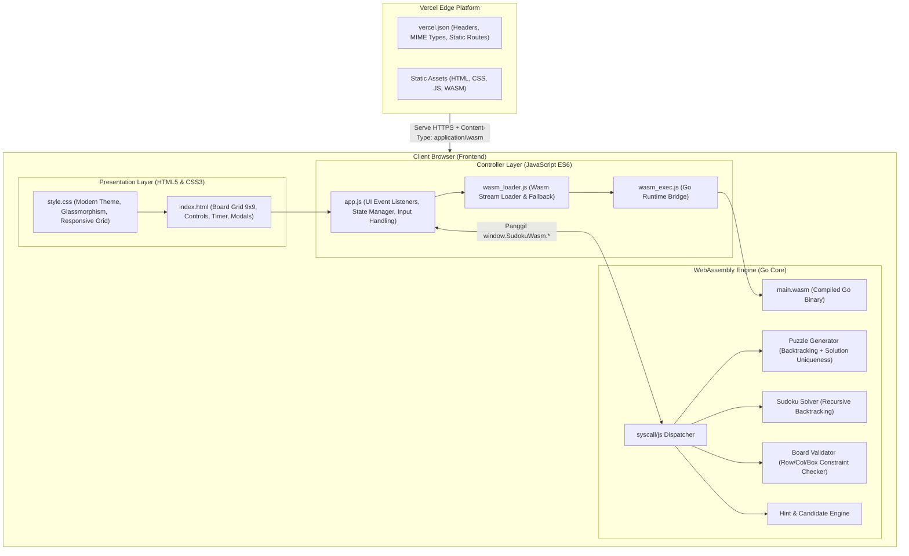

# Product Requirements Document (PRD) & Panduan Belajar WebAssembly
## WebAssembly Sudoku Master (Go-WASM)

> **Versi Dokumen:** 1.0.0  
> **Status:** Approved / Ready for Implementation  
> **Target Platform:** Web Browser (Desktop & Mobile) & Vercel Deployment  
> **Tech Stack:** Go (Golang) compiled to WebAssembly (WASM), HTML5, Vanilla Modern CSS, JavaScript (ES6+)  

---

# DAFTAR ISI
1. [BAGIAN I: PRODUCT REQUIREMENTS DOCUMENT (PRD)](#bagian-i-product-requirements-document-prd)
   - [1. Executive Summary & Visi Produk](#1-executive-summary--visi-produk)
   - [2. Arsitektur Sistem & Diagram Alur](#2-arsitektur-sistem--diagram-alur)
   - [3. Spesifikasi Fungsional (Core Features)](#3-spesifikasi-fungsional-core-features)
   - [4. Spesifikasi Non-Fungsional & UI/UX](#4-spesifikasi-non-fungsional--uiux)
   - [5. Struktur Proyek & Tech Stack](#5-struktur-proyek--tech-stack)
   - [6. Spesifikasi API Bridge (Go ↔ JavaScript)](#6-spesifikasi-api-bridge-go--javascript)
   - [7. Spesifikasi Deployment Vercel](#7-spesifikasi-deployment-vercel)
2. [BAGIAN II: PANDUAN EDUKASI & KONSEPTUAL WEBASSEMBLY](#bagian-ii-panduan-edukasi--konseptual-webassembly)
   - [1. Apa itu WebAssembly (Wasm) & Kenapa Menggunakan Go?](#1-apa-itu-webassembly-wasm--kenapa-menggunakan-go)
   - [2. Anatomi Kompilasi Go ke Wasm (`GOOS=js GOARCH=wasm`)](#2-anatomi-kompilasi-go-ke-wasm-goosjs-goarchwasm)
   - [3. Peran Krusial `wasm_exec.js`](#3-peran-krusial-wasm_execjs)
   - [4. Membedah Jembatan Komunikasi `syscall/js`](#4-membedah-jembatan-komunikasi-syscalljs)
   - [5. Mengapa Diperlukan `select {}` di Akhir `main()`?](#5-mengapa-diperlukan-select--di-akhir-main)
   - [6. Cara Browser Memuat Wasm (`instantiateStreaming`)](#6-cara-browser-memuat-wasm-instantiatestreaming)
   - [7. Masalah MIME Type `application/wasm` di Vercel](#7-masalah-mime-type-applicationwasm-di-vercel)
   - [8. Panduan Langkah Implementasi (Step-by-Step Roadmap)](#8-panduan-langkah-implementasi-step-by-step-roadmap)

---

# BAGIAN I: PRODUCT REQUIREMENTS DOCUMENT (PRD)

## 1. Executive Summary & Visi Produk

### 1.1 Visi Produk
Membangun web application game Sudoku modern dan responsif yang memanfaatkan performa tinggi **WebAssembly (Wasm)** yang dikompilasi dari bahasa **Go (Golang)**. Seluruh komputasi berat—seperti pembuatan puzzle dengan solusi unik (*unique solution generator*), algoritma penyelesaian cepat (*backtracking solver*), validasi pergerakan, dan generator petunjuk (*hint system*)—dijalankan secara lokal di browser melalui WebAssembly tanpa ketergantungan pada backend server.

### 1.2 Tujuan Utama (Goals)
1. **Kecepatan & Performa**: Menghasilkan dan memvalidasi papan Sudoku 9x9 dalam waktu < 2 milidetik menggunakan Go Wasm.
2. **Edukasi WebAssembly**: Menyediakan struktur kode modular dan terdokumentasi rapi yang memperlihatkan integrasi Go, `syscall/js`, `wasm_exec.js`, dan frontend web modern.
3. **User Experience Premium**: Antarmuka responsif (Desktop & Mobile) dengan tema modern (Dark/Light mode, Glassmorphism, animasi mikro, interaksi keyboard & on-screen numpad).
4. **Deployable to Vercel**: Dapat di-deploy langsung ke Vercel dengan konfigurasi static assets dan header MIME type yang tepat.

---

## 2. Arsitektur Sistem & Diagram Alur

### 2.1 Diagram Arsitektur Komponen



### 2.2 Siklus Hidup Permainan (Game Lifecycle)
1. **Inisialisasi**: Browser memuat `index.html`, `style.css`, `wasm_exec.js`, dan `app.js`.
2. **WASM Loading**: `wasm_loader.js` memanggil `WebAssembly.instantiateStreaming('main.wasm')` dan mengaktifkan runtime Go.
3. **Pendaftaran API**: Program Go mendaftarkan objek global `window.SudokuWasm` yang berisi fungsi-fungsi inti.
4. **Start Game**: JavaScript memanggil `window.SudokuWasm.generatePuzzle(difficulty)` -> Go membuat puzzle dan mengembalikan representasi string papan + solusi ke JavaScript.
5. **Gameplay Interaktif**:
   - Pemain memasukkan angka -> JS memanggil `validateMove` atau mengecek secara lokal.
   - Pemain menekan "Hint" -> JS memanggil `getHint(currentBoard, solution)` ke Go.
   - Pemain menekan "Solve" -> JS memanggil `solvePuzzle(currentBoard)` ke Go.
6. **Game Completion**: Ketika seluruh sel terisi benar, sistem menampilkan modal kemenangan dengan statistik waktu dan tingkat kesulitan.

---

## 3. Spesifikasi Fungsional (Core Features)

### 3.1 Go WebAssembly Core Engine

| Komponen | Deskripsi | Algoritma & Logika Go |
| :--- | :--- | :--- |
| **Sudoku Solver** | Menyelesaikan papan Sudoku 9x9 apa pun yang valid. | *Recursive Backtracking Algorithm* dengan teknik optimasi kandidat terkecil (*Minimum Remaining Values / MRV heuristic*). |
| **Puzzle Generator** | Membuat puzzle baru dengan tingkat kesulitan tertentu dan **hanya memiliki 1 solusi unik**. | 1. Isi papan kosong dengan solusi penuh secara acak.<br>2. Hapus angka satu per satu secara acak.<br>3. Uji apakah papan masih memiliki solusi unik (*single solution test*).<br>4. Ulangi sampai jumlah *clues* sesuai tingkat kesulitan. |
| **Difficulty Scaler** | Mengatur tingkat kesulitan puzzle. | • **Easy**: 38–44 clues (mudah ditebak dengan logika dasar)<br>• **Medium**: 30–36 clues<br>• **Hard**: 25–29 clues<br>• **Expert**: 21–24 clues (membutuhkan teknik eliminasi lanjut) |
| **Move Validator** | Memeriksa apakah suatu penempatan angka melanggar aturan Sudoku. | Validasi apakah angka sudah ada di baris yang sama, kolom yang sama, atau sub-grid 3x3 yang sama. |
| **Hint Engine** | Memberikan bantuan ketika pemain buntu. | Membandingkan kondisi papan pemain dengan *pre-computed solution* atau menjalankan solver untuk menemukan langkah berikutnya yang logis. |

### 3.2 Antarmuka & Interaksi Pemain (Frontend)

1. **Board Grid 9x9**:
   - 9 blok sub-grid 3x3 dengan garis batas tebal.
   - Tiap sel mendukung penulisan angka utama (*Value*) dan catatan pensil kecil (*Notes/Pencil Mode*).
   - Indikator visual sel:
     - Sel Bawaan (*Given/Clue*): Warna tegas, tidak dapat dihapus/diubah.
     - Sel Input Pengguna: Warna berbeda yang dapat diedit.
     - Sel Terpilih (*Active Cell*): Border bercahaya (*glow highlight*).
     - Sel Terkait (*Related Cells*): Highlight baris, kolom, dan sub-grid 3x3 yang sama.
     - Sel Angka Sama (*Same Number Highlight*): Menyorot seluruh angka yang sama di seluruh papan saat satu sel dipilih.
     - Sel Konflik/Error: Efek warna merah/goyang (*shake animation*) saat terjadi duplikasi aturan.
2. **Skema Input Ganda**:
   - **Keyboard Support**: Tombol panah/WASD untuk navigasi, tombol 1–9 untuk mengisi angka, Backspace/Delete untuk menghapus, tombol 'N' untuk toggle Notes/Pencil mode, tombol 'U' untuk Undo.
   - **On-Screen Numpad & Controls**: Tombol angka 1–9, Erase, Notes (Pencil), Undo, Redo, Hint, New Game.
3. **Pencil / Notes Mode**:
   - Menuliskan angka-angka kandidat kecil (1–9) di sudut-sudut sel sebelum memastikannya.
   - Saat angka pasti diisi, catatan kandidat di baris, kolom, dan sub-grid yang sama otomatis dibersihkan.
4. **History Stack (Undo / Redo)**:
   - Menyimpan setiap aksi pemain dalam array stack sehingga pemain bisa membatalkan (*Undo*) atau mengulangi (*Redo*) langkah tanpa batas.
5. **Game State & Timer**:
   - Timer realtime (Menit:Detik) dengan kemampuan Pause/Resume.
   - Penghitung kesalahan (*Mistake Counter* - opsi Mode Santai tanpa batas vs Mode Tantangan maks 3 kesalahan).
   - Status game disimpan ke `localStorage` agar tidak hilang saat browser di-refresh.
6. **Victory Celebration & Stats**:
   - Modal kemenangan dengan efek konfeti/partikel, waktu penyelesaian, efisiensi langkah, dan tombol untuk memulai game baru.

---

## 4. Spesifikasi Non-Fungsional & UI/UX

1. **Performa**:
   - Ukuran file `.wasm` terkompresi < 2.5 MB (atau < 800 KB dengan TinyGo/Brotli).
   - Waktu inisialisasi Wasm < 300 ms pada koneksi normal.
   - Waktu eksekusi generate puzzle < 5 ms.
2. **Desain Visual (Design Aesthetics)**:
   - Palet warna modern: Slate Dark (`#0f172a`), Indigo Accent (`#6366f1`), Cyan Glow (`#06b6d4`), Emerald Success (`#10b981`), Rose Error (`#f43f5e`).
   - Glassmorphism: Latar belakang semi-transparan dengan `backdrop-filter: blur(12px)`.
   - Tipografi modern menggunakan Google Fonts (*Outfit* atau *Inter*).
   - Responsif: Berfungsi optimal pada Smartphone (360px+), Tablet, dan Monitor Desktop (4K).
3. **Aksesibilitas (A11y)**:
   - Kontras warna teks dan latar belakang memenuhi standar WCAG AA.
   - Navigasi penuh melalui keyboard.

---

## 5. Struktur Proyek & Tech Stack

```text
c:\MyProject\WebAssembly/
├── cmd/
│   └── wasm/
│       ├── main.go            # Entry point Go WebAssembly, registrasi syscall/js
│       ├── solver.go          # Algoritma Backtracking Solver & Uniqueness Check
│       ├── generator.go       # Algoritma Pembuatan Puzzle berdasarkan Tingkat Kesulitan
│       └── validator.go       # Logika Validasi Baris, Kolom, dan Sub-grid
├── web/
│   ├── index.html             # UI Struktur Aplikasi
│   ├── css/
│   │   └── style.css          # Desain Modern CSS, Dark Mode, Animasi, Glassmorphism
│   ├── js/
│   │   ├── wasm_exec.js       # Jembatan runtime resmi dari Go distribution
│   │   ├── wasm_loader.js     # Modul pemanggil & inisialisasi WebAssembly
│   │   └── app.js             # Game controller, event handlers, DOM manipulation
│   └── assets/
│       └── favicon.svg        # Icon aplikasi
├── scripts/
│   ├── build.sh               # Shell script untuk build di Linux/macOS/Vercel
│   └── build.ps1              # PowerShell script untuk build di Windows
├── vercel.json                # Konfigurasi Vercel (Headers, MIME type, Routing)
├── go.mod                     # Go Module Definition
├── Makefile                   # Perintah otomasi build, run, dan test
├── PRD.md                     # Dokumen PRD dan Panduan WebAssembly (file ini)
└── README.md                  # Petunjuk instalasi dan cara menjalankan
```

---

## 6. Spesifikasi API Bridge (Go ↔ JavaScript)

Semua fungsi inti Go diekspos melalui objek global `window.SudokuWasm`:

### 6.1 `generatePuzzle(difficulty: string): string`
- **Input**: `"easy"` | `"medium"` | `"hard"` | `"expert"`
- **Output (JSON String)**:
  ```json
  {
    "puzzle": "003020600900305001001806400008102900700000008006708200002609500800203009005010300",
    "solution": "483921657967345821251876493548132976729564138136798245372689514814253769695417382",
    "difficulty": "medium",
    "cluesCount": 32
  }
  ```

### 6.2 `solvePuzzle(boardStr: string): string`
- **Input**: String 81 karakter (angka `0` mewakili kotak kosong)
- **Output (JSON String)**:
  ```json
  {
    "success": true,
    "solution": "483921657967345821251876493548132976729564138136798245372689514814253769695417382",
    "executionTimeMicroseconds": 450
  }
  ```

### 6.3 `validateMove(boardStr: string, row: int, col: int, val: int): bool`
- **Input**:
  - `boardStr`: String 81 karakter papan saat ini.
  - `row`: Indeks baris (0–8).
  - `col`: Indeks kolom (0–8).
  - `val`: Angka yang dimasukkan (1–9).
- **Output**: `true` jika valid tanpa konflik, `false` jika melanggar baris/kolom/blok 3x3.

### 6.4 `getHint(currentBoardStr: string, solutionStr: string): string`
- **Input**:
  - `currentBoardStr`: String 81 karakter kondisi papan saat ini.
  - `solutionStr`: String 81 karakter solusi lengkap.
- **Output (JSON String)**:
  ```json
  {
    "row": 0,
    "col": 1,
    "value": 8,
    "message": "Sel pada baris 1, kolom 2 adalah 8."
  }
  ```

---

## 7. Spesifikasi Deployment Vercel

### 7.1 Konfigurasi `vercel.json`
Vercel membutuhkan header khusus agar file `.wasm` disajikan dengan header `Content-Type: application/wasm`. Ini merupakan syarat mutlak agar browser dapat melakukan *streaming compilation* (`WebAssembly.instantiateStreaming`).

```json
{
  "version": 2,
  "cleanUrls": true,
  "headers": [
    {
      "source": "/(.*)\\.wasm",
      "headers": [
        {
          "key": "Content-Type",
          "value": "application/wasm"
        },
        {
          "key": "Cache-Control",
          "value": "public, max-age=31536000, immutable"
        }
      ]
    }
  ]
}
```

### 7.2 Build Script untuk Vercel (`scripts/build.sh`)
```bash
#!/bin/bash
set -e

echo "=== Memulai Build Go WebAssembly ==="

# 1. Pastikan folder output ada
mkdir -p web/js

# 2. Salin wasm_exec.js dari instalasi Go
cp "$(go env GOROOT)/misc/wasm/wasm_exec.js" web/js/wasm_exec.js

# 3. Kompilasi program Go ke WebAssembly binary
GOOS=js GOARCH=wasm go build -ldflags="-s -w" -o web/main.wasm ./cmd/wasm

echo "=== Build Selesai! Ukuran main.wasm: ==="
ls -lh web/main.wasm
```

---
---

# BAGIAN II: PANDUAN EDUKASI & KONSEPTUAL WEBASSEMBLY

Bagian ini dirancang khusus untuk menjelaskan teori, mekanisme internal, dan alur kerja WebAssembly agar Anda memahami secara mendalam apa yang terjadi di balik layar.

---

## 1. Apa itu WebAssembly (Wasm) & Kenapa Menggunakan Go?

### 1.1 Masalah Tradisional di Web
Di masa lalu, browser hanya dapat mengeksekusi satu bahasa: **JavaScript**. JavaScript adalah bahasa dinamis yang diinterpretasikan dan dioptimasi secara *Just-In-Time (JIT)*. Meskipun mesin JavaScript modern (seperti V8 di Chrome) sangat cepat, untuk tugas-tugas komputasi intensif (seperti algoritma matematika, pengolahan gambar, game 3D, atau simulasi *backtracking* Sudoku ribuan iterasi), JavaScript dapat mengalami *lag* dan lonjakan penggunaan memori karena *garbage collection pauses*.

### 1.2 WebAssembly sebagai Solusi
**WebAssembly (Wasm)** adalah format instruksi biner (*bytecode*) yang dirancang untuk dieksekusi di dalam mesin virtual browser dengan kecepatan mendekati kecepatan *native* (kecepatan aplikasi desktop C/C++/Go).

**Karakteristik Utama Wasm:**
1. **Compact Binary Format**: Berukuran kecil dan di-parse jauh lebih cepat daripada teks JavaScript.
2. **Predictable Performance**: Eksekusi konstan dan deterministik tanpa jeda kompilasi JIT yang berat.
3. **Sandboxed & Secure**: Berjalan di dalam lingkungan terisolasi dengan batas memori yang aman di dalam browser.

---

## 2. Anatomi Kompilasi Go ke Wasm (`GOOS=js GOARCH=wasm`)

Compiler Go memiliki dukungan bawaan (*built-in cross-compilation*) untuk berbagai platform tanpa memerlukan software tambahan.

```
+-------------------------------------------------------------+
|                      Kode Sumber Go                         |
|        (main.go, solver.go, generator.go, validator.go)     |
+-------------------------------------------------------------+
                              |
                              |  GOOS=js GOARCH=wasm go build
                              v
+-------------------------------------------------------------+
|                     Compiler Go                             |
|   1. Menerjemahkan syntax Go ke Intermediate Representation |
|   2. Menyertakan Go Runtime Minimal (Goroutines, GC, Heap)   |
|   3. Mengemas syscall/js ke WebAssembly Instruction Set     |
+-------------------------------------------------------------+
                              |
                              v
+-------------------------------------------------------------+
|                      File: main.wasm                        |
|             (Format Biner Bytecode WebAssembly)             |
+-------------------------------------------------------------+
```

### Mengapa Environment Variable ini Penting?
- `GOOS=js`: Memberitahu compiler bahwa sistem operasi target adalah lingkungan JavaScript (browser/Node.js).
- `GOARCH=wasm`: Memberitahu compiler bahwa arsitektur prosesor target adalah mesin virtual WebAssembly 32-bit (wasm32).

---

## 3. Peran Krusial `wasm_exec.js`

File biner WebAssembly (`.wasm`) tidak dapat berjalan sendiri di browser tanpa penghubung. WebAssembly membutuhkan *host environment* untuk menyediakan akses ke I/O, waktu, dan manipulasi DOM.

Di sinilah peran **`wasm_exec.js`**:
1. **Menyediakan Objek `Go` di JavaScript**:
   ```javascript
   const go = new Go(); // Didefinisikan di wasm_exec.js
   ```
2. **Menyediakan `importObject`**:
   Saat WebAssembly diinisialisasi, Wasm meminta daftar fungsi sistem (seperti `syscall`, `getTime`, `writeToConsole`). `go.importObject` menyediakan implementasi fungsi-fungsi tersebut dalam JavaScript.
3. **Menangani Memori & String Conversion**:
   Menerjemahkan array byte di memori WebAssembly menjadi string JavaScript (UTF-8) dan sebaliknya.

> **Lokasi File:** File `wasm_exec.js` selalu tersedia di instalasi Go Anda pada path:  
> `$(go env GOROOT)/misc/wasm/wasm_exec.js`

---

## 4. Membedah Jembatan Komunikasi `syscall/js`

Paket `syscall/js` adalah pustaka standar Go untuk berinteraksi langsung dengan JavaScript Virtual Machine dan DOM.

### 4.1 Mengakses Variabel Global JavaScript dari Go
```go
package main

import "syscall/js"

func main() {
    // Mengambil objek 'window' di browser
    jsWindow := js.Global()

    // Mengambil 'document'
    jsDocument := jsWindow.Get("document")

    // Menampilkan alert di browser dari Go!
    jsWindow.Call("alert", "Halo dari Go WebAssembly!")
}
```

### 4.2 Mendaftarkan Fungsi Go agar Bisa Dipanggil oleh JavaScript
Untuk membuat fungsi Go dapat dipanggil oleh JavaScript, kita membungkusnya dengan `js.FuncOf`:

```go
package main

import (
    "syscall/js"
)

// Signature fungsi wajib: (this js.Value, args []js.Value) any
func addNumbers(this js.Value, args []js.Value) any {
    // Mengambil argumen dari JS
    a := args[0].Int()
    b := args[1].Int()

    // Kembalikan hasil perhitungan ke JS
    return a + b
}

func main() {
    // Daftarkan ke window.hitungTambah
    js.Global().Set("hitungTambah", js.FuncOf(addNumbers))

    // Jaga agar program tetap berjalan
    select {}
}
```

Di sisi JavaScript, Anda tinggal memanggil:
```javascript
const hasil = window.hitungTambah(10, 25);
console.log(hasil); // Output: 35
```

---

## 5. Mengapa Diperlukan `select {}` di Akhir `main()`?

Dalam program Go biasa:
```go
func main() {
    println("Hello World")
}
```
Setelah baris terakhir selesai, program Go akan langsung keluar (*exit 0*).

Namun, dalam aplikasi WebAssembly berbasis event di browser, kita ingin fungsi-fungsi yang telah didaftarkan (`window.SudokuWasm.solvePuzzle`, dll.) **tetap dapat dipanggil kapan saja** ketika pemain menekan tombol di UI.

Jika `main()` selesai, runtime WebAssembly Go akan mati (*terminated*), dan pemanggilan fungsi berikutnya dari JavaScript akan menghasilkan error:
`Error: Go program has already exited`.

Dengan menambahkan:
```go
select {}
```
Kita menghentikan *main goroutine* tanpa menghabiskan CPU (*blocking channel forever*), sehingga runtime Go dan seluruh fungsi terdaftar tetap aktif di memori browser.

---

## 6. Cara Browser Memuat Wasm (`instantiateStreaming`)

Browser modern memiliki API yang sangat optimal untuk mengunduh dan mengompilasi WebAssembly secara bersamaan (*streaming compilation*).

```javascript
// web/js/wasm_loader.js
async function loadSudokuWasm() {
    // 1. Inisialisasi wrapper Go dari wasm_exec.js
    const go = new Go();

    try {
        // 2. Unduh dan compile biner Wasm secara paralel
        const wasmModule = await WebAssembly.instantiateStreaming(
            fetch('main.wasm'),
            go.importObject
        );

        // 3. Jalankan instance WebAssembly di background
        go.run(wasmModule.instance);

        console.log("Sudoku WebAssembly Engine berhasil dimuat!");
        return true;
    } catch (err) {
        console.error("Gagal memuat WebAssembly:", err);
        return false;
    }
}
```

---

## 7. Masalah MIME Type `application/wasm` di Vercel

Fungsi `WebAssembly.instantiateStreaming()` memiliki aturan keamanan ketat dari W3C: **Server harus mengembalikan respons dengan header HTTP `Content-Type: application/wasm`**.

Jika server menyajikan file `.wasm` sebagai `text/plain` atau `application/octet-stream`, browser akan menolak melakukan streaming compilation dan melempar error:
`TypeError: Failed to execute 'instantiateStreaming' on 'WebAssembly': Incorrect response MIME type`.

**Solusi pada Vercel:**
File `vercel.json` yang kita definisikan menjamin Vercel Edge Network mengirimkan header MIME `application/wasm` dengan konfigurasi caching yang sempurna.

---

## 8. Panduan Langkah Implementasi (Step-by-Step Roadmap)

Berikut adalah urutan langkah terstruktur untuk mengeksekusi proyek ini:

```
[Langkah 1: Setup Workspace & Go Module]
  ├── Inisialisasi go.mod
  └── Buat struktur folder cmd/wasm, web, scripts
         │
         ▼
[Langkah 2: Tulis Algoritma Inti Sudoku di Go]
  ├── solver.go (Backtracking algorithm)
  ├── generator.go (Puzzle generator dengan single-solution guarantee)
  └── validator.go (Aturan baris, kolom, box 3x3)
         │
         ▼
[Langkah 3: Buat Jembatan syscall/js di main.go]
  ├── Registrasi window.SudokuWasm
  └── Serialisasi data JSON untuk input/output
         │
         ▼
[Langkah 4: Kompilasi ke Wasm & Salin wasm_exec.js]
  ├── Jalankan build script (GOOS=js GOARCH=wasm)
  └── Dapatkan web/main.wasm dan web/js/wasm_exec.js
         │
         ▼
[Langkah 5: Bangun Frontend UI/UX Modern]
  ├── index.html (Grid 9x9, Numpad, Modals)
  ├── style.css (Dark mode, Glassmorphism, animations)
  └── app.js (Event handling, Notes mode, Undo/Redo)
         │
         ▼
[Langkah 6: Pengujian Lokal & Optimasi]
  ├── Jalankan local server (misal: go run server.go atau npx serve)
  └── Uji fungsi solver, generator, dan responsivitas
         │
         ▼
[Langkah 7: Konfigurasi Vercel & Deploy]
  ├── Buat vercel.json & scripts/build.sh
  └── Push ke Git repository dan deploy ke Vercel
```

---

*Dokumen ini siap dijadikan acuan utama dalam pembuatan kode dan implementasi proyek WebAssembly Sudoku.*
